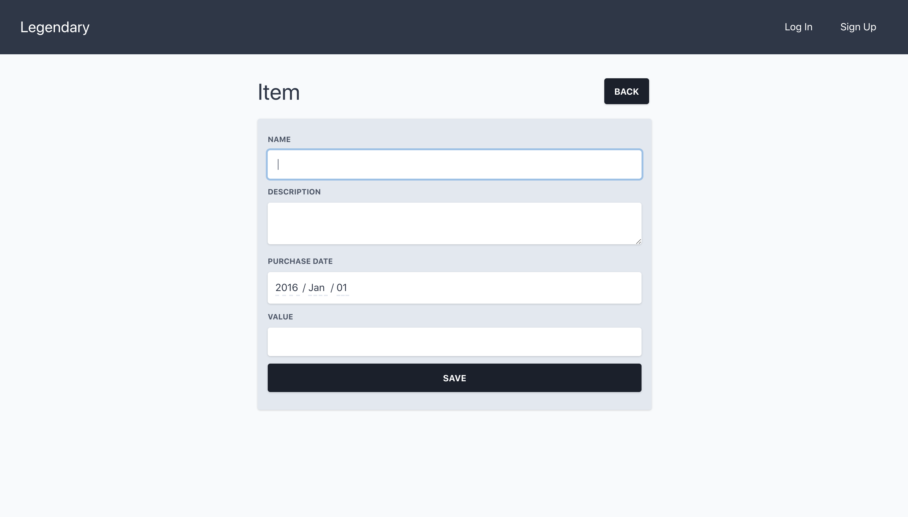

# Tutorial

This tutorial will teach by example you to make a simple application with Legendary.

We'll make a simple home inventory app. Our app will let users keep track of their possessions with some key characteristics like name, location, and value. We'll have two types of users— normal users and admins. We'll have a few features:

Normal User Features

- Adding items to their inventory
- Viewing a list of their items
- Updating their items
- Deleting their items

Admin Features

- Adding, viewing, updating, and deleting anyone's items
- Adding product categories and locations

We'll assume you have some general familiarity with programming— that you know a little bit about how to use the shell, a code editor, and git.

Let's get started.

# Prerequisites

While not strictly necessary, we recommend a couple of tools to make installing Legendary's dependencies (such as Node, Erlang, and Elixir):

- brew
- asdf

If you use brew and asdf, installing Legendary will automatically install the correct versions of Node, Erlang, and Elixir. Otherwise, you can manually install:

- erlang 23.0.2 or later
- elixir 1.10.3-otp-23 or later
- nodejs 14.5.0 or later

# Making a New Application

The first step is to clone the Legendary application template to a new project directory. We'll call it home_inventory:

```bash
$ git clone git@gitlab.com:mythic-insight/legendary.git home_inventory
$ cd home_inventory
```

This directory contains the skeleton of your app, plus a copy of Legendary to support it.

Let's start our server to check things out:

```bash
$ script/server
```

The first time you run the server, it will automatically install everything your project needs to run. This will take some time. The next time you run the server, everything will already be installed, so the process will be much faster.

You should now be able to visit [http://localhost:4000/](http://localhost:4000/) and see a home page. Congrats!


# Tour of the Code

# Generating Our First Resource

A resource is a chunk of related code that represents something your application does. In our example application, for example, we'll have an Item resource that represents one thing in a user's home inventory.

A few tasks go into having Items and having our app do useful things with them:

- We have a group of related things that a user can do, for example, creating an item, updating it, retrieving it to view later, deleting it, or even viewing whole lists of items. This group is called a context module.
- We need to describe what an Item is like, and how Items are stored. This is called a schema.
- We need to accept requests from the browser, perform some operations, then return a response. This is done by a controller.
- We need to generate markup that the browser can understand. This is done with views and templates.

It would be really tedious to have to create all these things by hand. Luckily, we have generators that do the boring part for us. There are a few different included generators, but we'll use phx.gen.html which generates all the parts of a resource. Let's generate our Item resource:

```bash
$ cd apps/app
$ mix phx.gen.html Inventory Item items name:string description:text purchase_date:date value:decimal
```

The generate command has quite a few parts, so let's walk through them one by one.

- mix is the elixir utility for running command line tasks
- phx.gen.html is the name of the generator. phx is for Phoenix (our parent framework), gen is for generators. html is because we're making a resource reachable as an html page.
- Inventory is the context where we are adding our resource. Right now it will just include Item and the Item-related features, but later it could include multiple related resources.
- items is the name of the database table to use to store Items.
- name:string, description:text, etc is a series of fields that each Item will have. The first part is the name of the field (e.g. description) and the second part is the type of the field (e.g. text).

You'll see that the generator made a few files:

```bash
* creating lib/app_web/controllers/item_controller.ex
* creating lib/app_web/templates/item/edit.html.eex
* creating lib/app_web/templates/item/form.html.eex
* creating lib/app_web/templates/item/index.html.eex
* creating lib/app_web/templates/item/new.html.eex
* creating lib/app_web/templates/item/show.html.eex
* creating lib/app_web/views/item_view.ex
* creating test/app_web/controllers/item_controller_test.exs
* creating lib/app/inventory/item.ex
* creating priv/repo/migrations/20210409172913_create_items.exs
* creating lib/app/inventory.ex
* injecting lib/app/inventory.ex
* creating test/app/inventory_test.exs
* injecting test/app/inventory_test.exs
```

In order to start doing things with Items, we need to do two small additional things:

- Migrating our database
- Setting up a route for the Item resource

# Migrating Our Database

Database migrations are how the application knows to change your database as you add new features (e.g. adding or deleting tables or columns). To run our pending migration, do this:

```bash
$ mix ecto.migrate
```

# Setting Up A Route

A route is what defines the URL structure of your application. It tells your application which URLs should be mapped to which controller actions. Let's add a simple route for Items.

In apps/app/lib/app_web/router.ex, you'll find a part that looks like :

```bash
scope "/" do
  pipe_through :browser

  pow_routes()
  pow_extension_routes()
end
```

We want to add

```bash
resources "/items", ItemController
```

within the scope. The finished code will look like this:

```bash
scope "/" do
  pipe_through :browser

  pow_routes()
  pow_extension_routes()
  resources "/items", AppWeb.ItemController
end
```

This will add some new URLs to our application:

- /items for viewing a list of items
- /items/:id for viewing a single item. :id stands in for a unique ID of the item
- It also maps the create, update, and delete actions for items.

Let's check it out by going to https://localhost:4000/items


You can see that we get an empty table of Items and a button that says "New Item." Let's see what happens when we click New Item. We get a form that allows us to create a new item, complete with all the fields that we set up.




If we save that, we're presented with a detail view for the Item. Note that it has all the things we filled in. If we click "Back", we go back to the table, but now we have an Item!


If you click on the ... menu in the table row. Try editing the Item. Then try deleting the Item. Pretty cool, right?

Congrats, you've made your first resource!

# Admin Site

All Legendary projects come with a built in administration tool. Let's check it out. First, we need to make an admin user:

```bash
$ mix legendary.create_admin
```

Give your email address and a password. Then, go to [localhost:4000](http://localhost:4000) and log in. Click Admin in the menu.

You'll see something like this:


You can see that some of the built-in resources, such as Users, Posts, and Comments are already in the admin. But Item isn't there. How do we add it?

We need to add Item to config/admin.exs:

```elixir
config :admin, Legendary.Admin,
  resources: [
    # Default admin config
    auth: [
      name: "Auth",
      resources: [
        user: [schema: Legendary.Auth.User, admin: Legendary.Auth.UserAdmin],
      ]
    ],
    content: [
      name: "Content",
      resources: [
        post: [schema: Legendary.Content.Post, admin: Legendary.Content.PostAdmin, label: "Posts and Pages", id_column: :name],
        comment: [schema: Legendary.Content.Comment, admin: Legendary.Content.CommentAdmin],
      ]
    ],
    # our new code
    inventory: [
      name: "Inventory",
      resources: [
        item: [schema: App.Inventory.Item],
      ]
    ]
  ]
```

Restart your server. For most changes, you don't need to restart, however, configuration changes like this one require a restart.

You'll see that admin users can now create, update, and delete Items.

# Making Things More Interesting

Right now, we have one list of items shared between all users. What if we want to limit each user's list of items to only ones that they created. We can extend our code a bit to accomplish this.

First, let's create a column in our database to store the item owner:

```bash
mix ecto.gen.migration add_owner_id_to_items
```

And use it to add an owner_id column and index for the owner_id column:

```elixir
defmodule App.Repo.Migrations.AddOwnerIdToItems do
  use Ecto.Migration

  def change do
    alter table("items") do
      add :owner_id, :integer
    end

    create index("items", [:owner_id])
  end
end
```

And run the migration:

```bash
mix ecto.migrate
```

In item.ex:

```elixir
schema "items" do
  field :description, :string
  field :name, :string
  field :purchase_date, :date
  field :value, :decimal
  field :owner_id, :integer # new!

  timestamps()
end

def changeset(item, attrs) do
  item
  # Add owner_id
  |> cast(attrs, [:name, :description, :purchase_date, :value, :owner_id])
  # Add owner_id
  |> validate_required([:name, :description, :purchase_date, :value, :owner_id])
end
```

Now that we have the column, how do we use it? We need to take the id of the current user and  pass it along when we create the item. The best place to do this is in the controller:

```elixir
def create(conn, %{"item" => item_params}) do
    %{id: current_user_id} = Pow.Plug.current_user(conn)

    case Inventory.create_item(Map.merge(item_params, %{"owner_id" => current_user_id})) do
      {:ok, item} ->
        conn
        |> put_flash(:info, "Item created successfully.")
        |> redirect(to: Routes.item_path(conn, :show, item))

      {:error, %Ecto.Changeset{} = changeset} ->
        render(conn, "new.html", changeset: changeset)
    end
  end
```

Now every item we create will have a defined owner.

We also need to filter the items shown based on the current user. In inventory.ex:

```elixir
def list_items(user_id) do
  Item
  |> where(owner_id: ^user_id)
  |> Repo.all()
end
```

and items_controller.ex:

```elixir
def index(conn, _params) do
  %{id: current_user_id} = Pow.Plug.current_user(conn)

  items = Inventory.list_items(current_user_id)
  render(conn, "index.html", items: items)
end
```

We also need to prevent any sneaky people from viewing, editing, or deleting an item that doesn't belong to them:

```elixir
plug :authorize when action in [:show, :edit, :update, :delete]

# ...

defp authorize(%{params: %{"id" => id}} = conn, _options) do
  item = Inventory.get_item!(id)
  %{id: current_user_id} = Pow.Plug.current_user(conn)

  if item.owner_id != current_user_id do
    conn
    |> put_status(403)
    |> text("Forbidden")
    |> halt()
  else
    conn
  end
end
```

This adds a plug that will be run before the show, edit, update, and delete actions. It loads the item in question, and checks it against the current user. If they don't match, we give an error message and stop the request. If they match, we continue on to the action.

There's one problem— if a user tries to visit /items and they aren't logged in, they receive an ugly error message instead of being helpfully redirected to sign in. It's a pretty bad experience. Let's fix that. In router.ex, change it so it looks like this:

```elixir
scope "/" do
  pipe_through :browser

  pow_routes()
  pow_extension_routes()
end

scope "/" do
  pipe_through :browser
  pipe_through :require_auth

  resources "/items", AppWeb.ItemController
end
```

`pipe_through :require_auth` tells the framework that those routes are only for signed in users! Give it a try. Notice that if you visit /items while you are logged out, you will be taken to the sign in page. And once you sign in, you'll be taken automatically back to items. Pretty cool!

# Testing

When you generate a new resource, Legendary will also generate a set of unit tests that correspond with it. But we just added new, untested functionality.

First, we need to make sure that our tests are run with a user. In item_controller_test.exs:

```elixir
# Add owner_id
@create_attrs %{description: "some description", name: "some name", purchase_date: ~D[2010-04-17], value: "120.5", owner_id: 123}
# Add owner_id
@update_attrs %{description: "some updated description", name: "some updated name", purchase_date: ~D[2011-05-18], value: "456.7", owner_id: 123}
@invalid_attrs %{description: nil, name: nil, purchase_date: nil, value: nil}

def fixture(:item) do
  {:ok, item} = Inventory.create_item(@create_attrs)
  item
end

setup %{conn: conn} do
  user = %Legendary.Auth.User{
    id: 123
  }

  conn =
    conn
    |> Pow.Plug.put_config(current_user_assigns_key: :current_user)
    |> Pow.Plug.assign_current_user(user, [])

  %{
    conn: conn
  }
end
```

And in inventory_test.exs, we need to tell our tests that valid items have an owner_id:

```elixir
@valid_attrs %{
  description: "test item description",
  name: "item description",
  purchase_date: ~D[2021-04-22],
  value: 200.00,
  owner_id: 123
}
```

# What's Next?

Legendary apps are just Phoenix apps with some bells and whistles included by default. The more you learn about Phoenix development, the more you'll know about building your app with Legendary. Here are some resources that we recommend:

- The Official Phoenix Framework Guides: [https://hexdocs.pm/phoenix/overview.html](https://hexdocs.pm/phoenix/overview.html)
- Programming Phoenix: [https://pragprog.com/titles/phoenix14/programming-phoenix-1-4/](https://pragprog.com/titles/phoenix14/programming-phoenix-1-4/)
- Phoenix LiveView Course by The Pragmatic Studio: [https://pragmaticstudio.com/courses/phoenix-liveview](https://pragmaticstudio.com/courses/phoenix-liveview)

To learn more about Legendary specifically, [check out the guides.](https://hexdocs.pm/legendary_core/)
